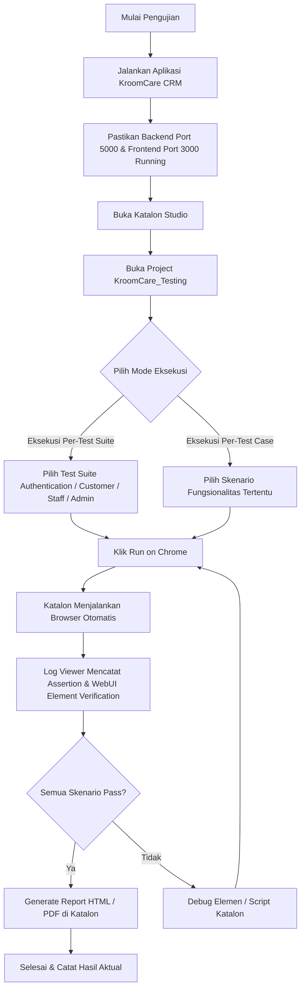

# Draft Pengujian Perangkat Lunak - KroomCare CRM

## Bab 4.x - Implementasi Pengujian Perangkat Lunak

---

## 1. Ruang Lingkup Pengujian

Pengujian dilakukan terhadap **semua fitur** yang tersedia pada sistem KroomCare CRM berdasarkan **3 role pengguna**:

| No | Role | Keterangan | Halaman yang Diuji |
|---|---|---|---|
| 1 | **Customer (Member)** | Pengguna akhir yang mengajukan keluhan (tickets), mencari solusi di forum publik, menukar poin reward, dan berkonsultasi dengan chatbot AI. | Landing Page, Dashboard, Forum Solusi, Tiketing (Daftar Keluhan & Buat Tiket Baru), Detail Thread (Forum Style), Hadiah & Voucher, Riwayat Poin, Profil, Pengaturan (Theme & 2FA), Chat Widget (AI Support). |
| 2 | **Staff (Customer Service)** | Staf frontliner yang menangani keluhan, merespons tiket di forum, dan melakukan eskalasi tiket prioritas tinggi. | Dashboard Staff (Incoming Complaints), Antrean Tiket, Forum Solusi, Detail Thread, Profil, Pengaturan (Theme & 2FA). |
| 3 | **Admin (Back-Office)** | Administrator sistem yang mengelola pengguna (Customer, Staff, Admin) dan melakukan pengaturan prioritas tiket secara global. | Dashboard Admin (Statistik), Manajemen Pengguna (CRUD, Suspend, Activate, Reset Poin), Pengaturan Tiket (Global Ticket Settings & Priority Control), Profil, Pengaturan (Theme & 2FA). |

### 1.1 Akun Test yang Dibutuhkan

| Email | Password | Role | Status |
|---|---|---|---|
| customer@kroombox.com | 121212 | CUSTOMER (MEMBER) | Active |
| staff@kroombox.com | 121212 | STAFF | Active |
| admin@kroombox.com | admin123# | ADMIN | Active |
| mutiaramadhan2410@gmail.com | 123456 / 123231 | CUSTOMER (MEMBER) | Active |

### 1.2 Instalasi Tools Pengujian

Eksekusi *test case* dapat dilakukan dengan menggunakan bantuan perangkat lunak *automation testing* seperti: selenium, testcomplete, katalon studio, dll. Tim penguji diperkenankan untuk memilih salah satu perangkat lunak tersebut. Selanjutnya, tim penguji harus menjelaskan tahapan atau langkah-langkah instalasi *automation testing software*. Berikut adalah tahapan instalasi Katalon Studio yang digunakan:

1. **Unduh Installer**: Buka situs resmi [Katalon](https://katalon.com), lakukan registrasi akun, dan unduh installer Katalon Studio sesuai dengan sistem operasi yang digunakan (Windows/macOS).
2. **Instalasi dan Aktivasi**: Ekstrak berkas installer ke direktori penyimpanan lokal (misalnya `C:\Katalon_Studio`), jalankan berkas executable `katalon.exe`, lalu masukkan kredensial akun Katalon yang telah didaftarkan untuk proses aktivasi lisensi gratis/trial.
3. **Konfigurasi WebDriver**: Selaraskan versi WebDriver dengan masuk ke menu *Tools* -> *Update WebDrivers* -> pilih browser target (seperti Chrome atau Firefox) agar kompatibel dengan versi browser terpasang di sistem.
4. **Buka Project Pengujian**: Salin berkas repository proyek KroomCare ke lokal, buka Katalon Studio, pilih opsi *Open Project*, lalu arahkan ke folder proyek pengujian KroomCare (`KroomCare_Testing`).

### 1.3 Cakupan Pengujian

Untuk membatasi proses pengujian, tim penguji perlu menentukan fungsionalitas yang akan diuji, teknik pengujian, serta penentuan jadwal pelaksanaan pengujian. Pada sub bab ini tim penguji menjelaskan semua cakupan proses pengujian.

#### 1.3.1 Fungsionalitas Sistem

Tim penguji harus mendeskripsikan semua fungsionalitas yang terdapat pada sistem. Deskripsi yang disampaikan setidaknya mencakup: kemampuan utama fitur, skema data input dan output, serta kriteria keberhasilan fitur. Setiap fungsionalitas yang dideskripsikan dibuat dalam bentuk paragraf sebagai berikut:

a. **Fungsionalitas Login**
   Fungsionalitas login digunakan untuk memeriksa (autentikasi) pengguna yang berhak mengakses sistem KroomCare CRM. Pada fungsionalitas login, pengguna (Customer, Staff, Admin) diharuskan mengisikan email dan password, serta kode OTP 6 digit jika otentikasi dua faktor (2FA) diaktifkan. Autentikasi dilakukan dengan mencocokkan kredensial masukan terhadap data yang tersimpan di database. Jika data salah atau kosong, sistem menampilkan pesan error (gagal). Sebaliknya, jika data sesuai (benar), pengguna berhasil masuk dan dialihkan ke halaman dashboard masing-masing.

b. **Fungsionalitas Register**
   Fungsionalitas register digunakan oleh calon pelanggan (Customer) untuk mendaftarkan akun baru ke dalam sistem. Pada fungsionalitas register, pengguna diharuskan mengisi data berupa nama lengkap, alamat email yang valid, serta password dan konfirmasi password. Jika pendaftaran gagal (misalnya email sudah terdaftar), sistem menampilkan toast error. Sebaliknya, jika pendaftaran berhasil, sistem menyimpan akun baru ke database, menampilkan notifikasi sukses, dan secara otomatis mengarahkan pengguna kembali ke halaman login.

c. **Fungsionalitas Lupa Password**
   Fungsionalitas lupa password digunakan untuk memulihkan kata sandi akun pengguna yang lupa. Pengguna diharuskan mengisikan email terdaftar untuk meminta kode OTP verifikasi. Jika verifikasi OTP dan password baru berhasil disesuaikan, sistem akan memperbarui kata sandi pengguna di database dan mengizinkan pengguna untuk masuk kembali menggunakan sandi baru. Sebaliknya, sistem menampilkan error jika email tidak terdaftar atau kode OTP salah.

d. **Fungsionalitas Customer Dashboard**
   Fungsionalitas customer dashboard digunakan untuk menyajikan halaman beranda utama khusus untuk pengguna dengan peran Customer yang telah sukses melakukan autentikasi login. Dashboard ini menampilkan informasi personal berupa perolehan poin loyalitas, overview layanan aktif, serta sidebar navigasi. Sistem akan otomatis memblokir akses dan mengalihkan pengguna kembali ke halaman login jika mendeteksi halaman diakses tanpa sesi login aktif.

e. **Fungsionalitas Tiketing & Keluhan**
   Fungsionalitas tiketing dan keluhan digunakan oleh Customer untuk membuat tiket pengaduan baru, memantau riwayat tiket pribadi, serta melakukan diskusi balasan dengan staf customer service. Ketika membuat tiket pengaduan baru, pengguna menginput kategori, subjek, serta deskripsi keluhan. Jika pembuatan tiket sukses, sistem mencatat tiket di database, menambahkan loyalty points (+50 koin), dan mengizinkan pengguna untuk saling berkirim tanggapan dalam forum chat detail tiket.

f. **Fungsionalitas Forum Solusi Publik**
   Fungsionalitas forum solusi publik digunakan sebagai basis pengetahuan interaktif untuk mencari solusi keluhan yang pernah diselesaikan (Resolved) guna menghindari tiket duplikat, serta membuat thread diskusi baru. Pengguna dapat mencari solusi dengan mengetikkan kata kunci pencarian. Jika thread baru dibuat, sistem memvalidasi input judul dan konten forum, lalu memublikasikan thread baru ke linimasa forum publik agar dapat dibaca oleh pengguna lain.

g. **Fungsionalitas Reward & Voucher**
   Fungsionalitas reward dan voucher digunakan oleh Customer untuk menukarkan koin reward yang telah dikumpulkan dengan voucher diskon belanja yang tersedia pada katalog reward. Ketika menekan tombol penukaran, sistem akan memeriksa apakah poin Customer mencukupi batas minimal. Jika koin cukup, sistem memotong poin loyalitas Customer, menampilkan kode voucher diskon yang siap pakai, dan memunculkan toast sukses. Jika koin tidak mencukupi, proses penukaran diblokir.

h. **Fungsionalitas Point History**
   Fungsionalitas point history digunakan oleh Customer untuk melihat riwayat transaksi perolehan dan penggunaan poin loyalitas reward secara transparan. Halaman ini memuat tabel transaksional yang bersumber dari database yang menampilkan tanggal transaksi, jumlah koin yang masuk (earned) atau keluar (spent), serta keterangan aktivitas transaksi. Tabel riwayat akan gagal dimuat jika sesi pengguna tidak valid.

i. **Fungsionalitas Chat Widget AI Support**
   Fungsionalitas chat widget AI support digunakan untuk memberikan respon panduan pemecahan masalah secara instan kepada Customer bertenaga kecerdasan buatan (AI). Pengguna dapat berinteraksi dengan membuka widget chat di pojok kanan bawah dan mengetikkan pertanyaan seputar kendala sistem. Chatbot AI kemudian menganalisis pesan masukan dan mengembalikan balasan jawaban solusi instan yang relevan secara real-time.

j. **Fungsionalitas Staff Dashboard & Antrean Keluhan**
   Fungsionalitas staff dashboard dan antrean keluhan digunakan oleh pengguna dengan peran Staff (Customer Service) untuk menangani keluhan pelanggan yang masuk. Staff dapat melihat antrean tiket keluhan pelanggan, memfilter antrean berdasarkan shift kerja, memberikan pesan respons balasan untuk mereset status tiket menjadi diproses, serta melakukan eskalasi/transfer tiket prioritas tinggi langsung ke tim teknis (maintenance).

k. **Fungsionalitas Admin User Management & Settings**
   Fungsionalitas admin user management dan settings digunakan oleh pengguna dengan peran Admin untuk mengelola akun pengguna sistem dan memantau ringkasan statistik CRM. Admin dapat melihat total statistik tiket, mendaftarkan akun baru untuk tim Staff dengan menentukan nama, email, password, dan role, serta melakukan penyetelan ulang (reset) poin loyalitas reward Customer ke angka 0.

l. **Fungsionalitas Global Ticket Settings**
   Fungsionalitas global ticket settings digunakan oleh Admin untuk mengontrol pengaturan seluruh tiket keluhan yang terdaftar di sistem secara global. Pada menu ini, Admin dapat melihat daftar seluruh tiket dari semua Customer dan memperbarui tingkat prioritas tiket (seperti mengubah dari prioritas rendah ke prioritas tinggi) yang langsung terintegrasi secara real-time pada database.

m. **Fungsionalitas Profile & Keamanan**
   Fungsionalitas profile dan keamanan digunakan oleh seluruh pengguna terdaftar untuk memperbarui data profil personal serta meningkatkan proteksi keamanan akun. Pengguna dapat memperbarui nama lengkap di profil. Selain itu, pengguna dapat mengaktifkan verifikasi Two-Factor Authentication (2FA) dengan memindai QR code dan memasukkan kode verifikasi 6 digit yang valid dari Google Authenticator, atau menonaktifkannya kembali.

#### 1.3.2 Teknik Pengujian

Pada proses pengujian, tim penguji harus menentukan pendekatan dan teknik yang digunakan untuk menyusun *test case* dan menentukan *test data*. Pada sub bab ini, tim penguji menjelaskan pendekatan dan teknik pengujian yang digunakan:

*   **Black Box Testing**:
    Pengujian difokuskan sepenuhnya pada fungsionalitas sistem dari luar tanpa menganalisis alur kode internal perangkat lunak.
*   **Equivalence Partitioning (EP)**:
    Domain input dibagi ke dalam partisi/kelas data (valid dan tidak valid) untuk menyusun *test case* yang efisien.
*   **Boundary Value Analysis (BVA)**:
    Pengujian dipusatkan pada nilai-nilai batas ekstrem sistem (seperti input kosong/null dan panjang karakter input kode OTP).

#### 1.3.3 Jadwal dan Pengawakan

Pembuatan rancangan (*test case*) dan pelaksanaan pengujian harus dijadwalkan dengan melibatkan seluruh anggota tim penguji sebagai perancang dan pelaksana pengujian. Pada sub bab ini tim penguji menentukan jadwal pelaksanaan pengujian sekaligus memetakan anggota tim dengan fungsionalitas-fungsionalitas yang akan diujinya:

*   **Tim Penguji**:
    *   **Tazkya Mutia** (QA Lead): Bertanggung jawab atas desain rancangan *test case*, instalasi dan setup Katalon Studio, penulisan Groovy script, eksekusi test suite, verifikasi hasil log, serta penyusunan laporan akhir pengujian.

*   **Tabel Jadwal Pelaksanaan**:

| Tahap Pengujian | Aktivitas Pengujian | Target Pelaksanaan | Keterangan |
|---|---|---|---|
| Tahap 1 | Analisis Sistem & Rancangan Test Case | Minggu ke-1 | Pemetaan fungsionalitas dan draf Tabel 2-1 s/d 2-13 |
| Tahap 2 | Instalasi Tools & Setup Environment | Minggu ke-2 | Setup Katalon Studio, konfigurasi port localhost:3000, penyiapan data akun |
| Tahap 3 | Pembuatan Object Repository & Scripting | Minggu ke-3 | Spy & Capture elemen web KroomCare, pembuatan script Groovy |
| Tahap 4 | Eksekusi Pengujian Otomatis & Logging | Minggu ke-4 | Running Test Suite di Chrome, verifikasi assert |
| Tahap 5 | Evaluasi Hasil & Penyusunan Laporan | Minggu ke-5 | Analisis hasil aktual, penarikan kesimpulan, dan finalisasi dokumen |

---

## 2. Perancangan Pengujian

Bab ini berisi deskripsi test case yang dirancang untuk menguji setiap fungsionalitas yang tersedia pada sistem KroomCare CRM. Test case yang dibuat mengimplementasikan pendekatan **Black Box Testing** dengan teknik **Equivalence Partitioning** dan **Boundary Value Analysis**.

---

### Tabel 2-1 Rancangan Pengujian Fungsionalitas Login (Semua Role)

| Fungsionalitas | ID Test Case | Deskripsi/Skenario | Pra Kondisi | Langkah Pengujian | Data Pengujian | Hasil yang Diharapkan |
|---|---|---|---|---|---|---|
| Login | TC-LGN-01 | Pengguna tidak mengisikan email dan password | Pengguna berada pada halaman login (`/login`) | 1. Buka halaman login<br>2. Klik tombol "Login" tanpa mengisi field apapun | • email = null<br>• password = null | Login gagal, browser menampilkan validasi HTML5 "Please fill out this field" |
| Login | TC-LGN-02 | Pengguna mengisikan email yang tidak terdaftar | Pengguna berada pada halaman login | 1. Buka halaman login<br>2. Isikan email tidak terdaftar<br>3. Isikan password<br>4. Klik tombol "Login" | • email= tazkyamutia@gmail.com<br>• password = 123123 | Login gagal, muncul toast/alert error "Email tidak terdaftar." |
| Login | TC-LGN-03 | Pengguna mengisikan password yang salah | Pengguna berada pada halaman login | 1. Buka halaman login<br>2. Isikan email yang terdaftar<br>3. Isikan password salah<br>4. Klik tombol "Login" | • email = customer@kroombox.com<br>• password = 123456 | Login gagal, muncul toast/alert error "Password salah." |
| Login | TC-LGN-04 | Login berhasil sebagai CUSTOMER | Pengguna berada pada halaman login | 1. Buka halaman login<br>2. Isikan email customer<br>3. Isikan password customer<br>4. Klik tombol "Login" | • email= customer@kroombox.com<br>• password = 121212 | Login berhasil, diarahkan ke dashboard |
| Login | TC-LGN-05 | Login berhasil sebagai STAFF | Pengguna berada pada halaman login | 1. Buka halaman login<br>2. Isikan email staff<br>3. Isikan password staff<br>4. Klik tombol "Login" | • email= staff@kroombox.com<br>• password = 121212 | Login berhasil, diarahkan ke dashboard staff / (Staff Dashboard) |
| Login | TC-LGN-06 | Login berhasil sebagai ADMIN | Pengguna berada pada halaman login | 1. Buka halaman login<br>2. Isikan email admin<br>3. Isikan password admin<br>4. Klik tombol "Login" | • email= admin@kroombox.com<br>• password = admin123# | Login berhasil, diarahkan ke dashboard admin / (Admin Dashboard) |
| Login | TC-LGN-07 | Login dengan verifikasi Two-Factor Authentication (2FA) | Pengguna berada pada halaman login | 1. Masukkan email & password terdaftar<br>2. Klik tombol "Login"<br>3. Verifikasi halaman beralih ke form OTP 2FA<br>4. Masukkan kode OTP 6 digit yang valid | • email = mutiaramadhan2410@gmail.com<br>• password = 123456<br>• otp = {valid OTP code} | Login berhasil, pengguna dialihkan ke dashboard utama |

---

### Tabel 2-2 Rancangan Pengujian Fungsionalitas Register

| Fungsionalitas | ID Test Case | Deskripsi/Skenario | Pra Kondisi | Langkah Pengujian | Data Pengujian | Hasil yang Diharapkan |
|---|---|---|---|---|---|---|
| Register | TC-REG-01 | Pengguna mendaftar tanpa mengisi field wajib | Pengguna berada pada halaman register (/register) | 1. Buka halaman register<br>2. Klik tombol "Daftar" tanpa mengisi apapun | • email = null<br>• password = null | Login gagal, browser menampilkan validasi HTML5 "Please fill out this field" |
| Register | TC-REG-02 | Pengguna mendaftar dengan email yang sudah terdaftar | Pengguna berada pada halaman register | 1. Isikan nama lengkap<br>2. Isikan email terdaftar<br>3. Isikan password<br>4. Klik "Daftar" | • email= mutiaramadhan2410@gmail.com<br>• password = 123123 | Register gagal, muncul toast error "Email sudah terdaftar." |
| Register | TC-REG-03 | Pengguna mendaftar dengan data valid | Pengguna berada pada halaman register | 1. Isikan nama lengkap<br>2. Isikan email baru<br>3. Isikan password<br>4. Klik "Daftar" | • email= customer@kroombox.com<br>• password = 123456 | Register berhasil, muncul toast "Registrasi berhasil. Silakan login." dan diarahkan ke halaman /login |

---

### Tabel 2-3 Rancangan Pengujian Fungsionalitas Forgot Password

| Fungsionalitas | ID Test Case | Deskripsi/Skenario | Pra Kondisi | Langkah Pengujian | Data Pengujian | Hasil yang Diharapkan |
|---|---|---|---|---|---|---|
| Forgot Password | TC-FP-01 | Mengajukan OTP reset password dengan email tidak terdaftar | Pengguna berada pada modal / halaman Lupa Password | 1. Isikan email tidak terdaftar<br>2. Klik "Kirim OTP" | • email = tazkyamutia@gmail.com<br>• password= 111111 | Muncul error "Email tidak ditemukan." |
| Forgot Password | TC-FP-02 | Mengajukan OTP reset password dengan email valid | Pengguna berada pada halaman Lupa Password | 1. Isikan email terdaftar<br>2. Klik "Kirim OTP" | • email= mutiaramadhan2410@gmail.com<br>• password = 123456 | OTP berhasil dikirim ke email, beralih ke form verifikasi OTP & password baru |
| Forgot Password | TC-FP-03 | Reset password dengan OTP salah atau kadaluarsa | Halaman verifikasi OTP reset password terbuka | 1. Masukkan kode OTP salah<br>2. Masukkan password baru<br>3. Klik "Reset Password" | • email= mutiaramadhan2410@gmail.com<br>• password = 123456<br>• OTP= 432146 | Reset password gagal, muncul error "Kode OTP salah." |
| Forgot Password | TC-FP-04 | Reset password dengan data valid | Halaman verifikasi OTP reset password terbuka | 1. Masukkan kode OTP yang valid dari email<br>2. Masukkan password baru<br>3. Klik "Reset Password" | • email= mutiaramadhan2410@gmail.com<br>• password = 123456<br>• OTP= 721391 | Reset password berhasil, muncul pesan sukses dan diarahkan ke login |

---

### Tabel 2-4 Rancangan Pengujian Fungsionalitas Customer Dashboard (Role: CUSTOMER)

| Fungsionalitas | ID Test Case | Deskripsi/Skenario | Pra Kondisi | Langkah Pengujian | Data Pengujian | Hasil yang Diharapkan |
|---|---|---|---|---|---|---|
| Customer Dashboard | TC-CUD-01 | Menampilkan dashboard utama customer | Pengguna masuk sebagai CUSTOMER | 1. Login sebagai CUSTOMER<br>2. Verifikasi informasi points, overview layanan, dan sidebar tampil | • email= mutiaramadhan2410@gmail.com<br>• password = 123231 | Halaman dashboard customer tampil lengkap dengan indicator loyalty points |
| Customer Dashboard | TC-CUD-02 | Akses halaman dashboard tanpa login | Pengguna belum masuk ke sistem | 1. Akses langsung URL / | • Tidak ada | Pengguna dialihkan (redirect) ke Landing Page / atau /login |

---

### Tabel 2-5 Rancangan Pengujian Fungsionalitas Tiketing & Keluhan (Role: CUSTOMER)

| Fungsionalitas | ID Test Case | Deskripsi/Skenario | Pra Kondisi | Langkah Pengujian | Data Pengujian | Hasil yang Diharapkan |
|---|---|---|---|---|---|---|
| Tiketing | TC-TKT-01 | Menampilkan daftar tiket keluhan pribadi | Pengguna login sebagai CUSTOMER | 1. Buka sidebar, klik menu "Tiket Saya" ("/tickets") | • email= mutiaramadhan2410@gmail.com<br>• password = 123231 | Menampilkan daftar tiket keluhan yang pernah diajukan beserta status dan prioritasnya |
| Tiketing | TC-TKT-02 | Membuat tiket keluhan baru dengan data valid | Pengguna berada pada halaman buat tiket (`/tickets/new`) | 1. Pilih Kategori Keluhan<br>2. Masukkan Subjek keluhan<br>3. Masukkan Deskripsi keluhan<br>4. Klik "Kirim Keluhan" | category = "Technical"<br>subject = "Server error 500 saat checkout"<br>description = "Website down ketika melakukan payment proses." | Tiket berhasil dibuat, muncul toast sukses, poin bertambah (+50 poin), diarahkan kembali ke `/tickets` |
| Tiketing | TC-TKT-03 | Berinteraksi dalam detail tiket keluhan | Pengguna berada di halaman detail tiket keluhan (`/tickets/:id`) | 1. Ketik pesan respons di input chat<br>2. Klik tombol "Kirim" | replyText = "Apakah sudah diperbaiki staf?" | Pesan balasan berhasil terkirim, muncul dalam forum-style discussion di detail thread |

---

### Tabel 2-6 Rancangan Pengujian Forum Solusi Publik (Role: CUSTOMER)

| Fungsionalitas | ID Test Case | Deskripsi/Skenario | Pra Kondisi | Langkah Pengujian | Data Pengujian | Hasil yang Diharapkan |
|---|---|---|---|---|---|---|
| Forum Solusi | TC-FRM-01 | Mencari solusi publik untuk menghindari duplikasi tiket | Pengguna berada di halaman Forum Solusi (`/forum`) | 1. Ketik kata kunci keluhan di search bar forum<br>2. Tekan Enter atau amati hasil filter dinamis | query = "Hosting" | Menampilkan hasil pencarian thread/tiket terkait "Hosting" yang berstatus "Resolved" |
| Forum Solusi | TC-FRM-02 | Membuka detail solusi publik (Resolved) | Pengguna berada di halaman Forum Solusi | 1. Klik salah satu thread forum milik user lain berstatus "Resolved" | (thread ID target) | Detail percakapan antara customer lain dan staff tampil untuk referensi solusi |
| Forum Solusi | TC-FRM-03 | Membuat thread diskusi baru di Forum | Pengguna berada di halaman Forum Solusi | 1. Klik tab "Buat Diskusi"<br>2. Masukkan judul diskusi<br>3. Masukkan konten diskusi<br>4. Klik tombol "Buat" | judul = "Optimasi Cache VPS"<br>konten = "Bagaimana cara set up Redis cache?" | Thread forum baru berhasil terbit, dan tampil di daftar forum publik |

---

### Tabel 2-7 Rancangan Pengujian Reward & Voucher (Role: CUSTOMER)

| Fungsionalitas | ID Test Case | Deskripsi/Skenario | Pra Kondisi | Langkah Pengujian | Data Pengujian | Hasil yang Diharapkan |
|---|---|---|---|---|---|---|
| Reward & Voucher | TC-RWD-01 | Menampilkan katalog penukaran voucher | Pengguna login sebagai CUSTOMER | 1. Buka sidebar, klik menu "Rewards" (`/rewards`) | (akun customer) | Menampilkan poin saat ini dan daftar voucher diskon yang dapat ditukar |
| Reward & Voucher | TC-RWD-02 | Melakukan redeem voucher dengan koin cukup | Pengguna memiliki koin_reward mencukupi untuk voucher target | 1. Klik tombol "Tukar" pada voucher diskon pilihan<br>2. Konfirmasi penukaran di modal pop-up | voucherRequiredPoints = 200<br>userPoints = 850 | Poin berkurang 200, transaksi tercatat, kode voucher diskon ditampilkan, dan toast sukses muncul |
| Reward & Voucher | TC-RWD-03 | Melakukan redeem voucher dengan koin tidak cukup | Pengguna memiliki koin_reward kurang dari batas penukaran | 1. Klik tombol "Tukar" pada voucher bernilai poin tinggi | voucherRequiredPoints = 500<br>userPoints = 150 | Penukaran diblokir / tombol disabled, atau muncul toast error "Koin tidak mencukupi." |

---

### Tabel 2-8 Rancangan Pengujian Point History (Role: CUSTOMER)

| Fungsionalitas | ID Test Case | Deskripsi/Skenario | Pra Kondisi | Langkah Pengujian | Data Pengujian | Hasil yang Diharapkan |
|---|---|---|---|---|---|---|
| Point History | TC-PTH-01 | Menampilkan riwayat transaksi poin | Pengguna login sebagai CUSTOMER | 1. Klik indikator poin di header atau menu `/points-history` | (akun customer) | Menampilkan daftar riwayat poin masuk (earned) dan keluar (spent) beserta keterangan transaksi |

---

### Tabel 2-9 Rancangan Pengujian Chat Widget AI Support (Role: CUSTOMER)

| Fungsionalitas | ID Test Case | Deskripsi/Skenario | Pra Kondisi | Langkah Pengujian | Data Pengujian | Hasil yang Diharapkan |
|---|---|---|---|---|---|---|
| AI Support | TC-AIC-01 | Bertanya lewat Chat Widget AI | Pengguna login sebagai CUSTOMER | 1. Klik ikon Chat Widget di pojok kanan bawah<br>2. Masukkan pertanyaan seputar kendala server<br>3. Klik kirim | message = "Bagaimana cara mengatasi error 500?" | Pesan dikirim, loading indicator tampil, dan AI mengembalikan jawaban bantuan instan |

---

### Tabel 2-10 Rancangan Pengujian Staff Dashboard & Antrean Keluhan (Role: STAFF)

| Fungsionalitas | ID Test Case | Deskripsi/Skenario | Pra Kondisi | Langkah Pengujian | Data Pengujian | Hasil yang Diharapkan |
|---|---|---|---|---|---|---|
| Staff Features | TC-STF-01 | Menampilkan dashboard antrean keluhan masuk | Pengguna login sebagai STAFF | 1. Buka dashboard utama `/` atau menu Antrean Tiket (`/staff`) | (akun staff) | Menampilkan daftar tiket keluhan masuk dengan status "Menunggu" atau "Diproses" |
| Staff Features | TC-STF-02 | Memfilter keluhan berdasarkan shift/waktu | Pengguna berada di dashboard staff | 1. Ubah filter waktu / shift kerja | filter = "Shift Pagi (08:00 - 16:00)" | Antrean tiket terfilter secara dinamis menyesuaikan waktu pembuatan |
| Staff Features | TC-STF-03 | Merespons/menjawab keluhan pelanggan | Pengguna membuka detail keluhan pelanggan | 1. Pilih tiket berstatus "Menunggu"<br>2. Ketik balasan pada kolom respons<br>3. Klik "Kirim" | replyText = "Halo, kami sedang memeriksa kendala SSL Anda." | Tiket berubah status menjadi "Diproses", balasan terkirim, customer mendapat pembaruan thread |
| Staff Features | TC-STF-04 | Eskalasi tiket ke tim teknis (Transfer to Maintenance) | Pengguna berada di detail tiket keluhan prioritas "High" | 1. Buka tiket prioritas "High"<br>2. Klik tombol "Transfer ke Maintenance" | (tiket ID prioritas tinggi) | Sistem mencatat eskalasi tiket ke tim teknis, muncul toast sukses, status tiket diperbarui |

---

### Tabel 2-11 Rancangan Pengujian Fungsionalitas Admin Dashboard & User Management

| Fungsionalitas | ID Test Case | Deskripsi/Skenario | Pra Kondisi | Langkah Pengujian | Data Pengujian | Hasil yang Diharapkan |
|---|---|---|---|---|---|---|
| Admin Dashboard | TC-ADM-01 | Menampilkan statistik monitoring sistem | Pengguna login sebagai ADMIN | 1. Akses dashboard utama / | • (akun admin) | Menampilkan statistik total tiket, tiket terselesaikan (resolved), total user, dan grafik harian |
| Admin Dashboard | TC-ADM-02 | Melakukan CRUD Akun Pengguna Baru | Pengguna berada di menu Manajemen Pengguna (/admin/users) | 1. Klik "Tambah User"<br>2. Isikan data nama, email, password, dan pilih role STAFF<br>3. Simpan data | • nama = "caramel"<br>• email = lattemachiato245@gmail.com<br>• password = pass123#<br>• role = "staff" | Akun staff baru berhasil dibuat dan tampil dalam tabel user |
| Admin Dashboard | TC-ADM-03 | Mengatur ulang (Reset) Poin Koin Reward Customer | Pengguna berada di menu Manajemen Pengguna | 1. Cari akun CUSTOMER dengan poin tertentu<br>2. Klik tombol "Reset Poin" (ikon RefreshCw) | • (customer ID target) | Poin customer tersebut kembali ke angka 0, data tersinkronisasi |

---

### Tabel 2-12 Rancangan Pengujian Fungsionalitas Global Ticket Settings

| Fungsionalitas | ID Test Case | Deskripsi/Skenario | Pra Kondisi | Langkah Pengujian | Data Pengujian | Hasil yang Diharapkan |
|---|---|---|---|---|---|---|
| Ticket Settings | TC-TKS-01 | Menampilkan daftar pengaturan seluruh tiket secara global | Pengguna login sebagai ADMIN | 1. Akses menu "Pengaturan Tiket" (/admin/tickets) | • (akun admin) | Menampilkan seluruh daftar tiket yang ada di sistem dari semua customer |
| Ticket Settings | TC-TKS-02 | Mengubah skala Prioritas Tiket secara global | Pengguna berada di halaman Pengaturan Tiket | 1. Klik dropdown Priority pada salah satu tiket<br>2. Ubah dari "Low" menjadi "High" | • ticketId = #7<br>• priority = "High" | Prioritas tiket diperbarui menjadi "High" secara real-time di database dan sistem |

---

### Tabel 2-13 Rancangan Pengujian Fungsionalitas Profile & Keamanan

| Fungsionalitas | ID Test Case | Deskripsi/Skenario | Pra Kondisi | Langkah Pengujian | Data Pengujian | Hasil yang Diharapkan |
|---|---|---|---|---|---|---|
| Profile & 2FA | TC-PRF-01 | Memperbarui Data Diri Profil | Pengguna berada di halaman /profile | 1. Ubah field Nama Lengkap<br>2. Klik "Simpan Perubahan" | • nama = "mutia tazkya" | Nama profil berhasil diperbarui, terintegrasi ke database |
| Profile & 2FA | TC-PRF-02 | Mengaktifkan Two-Factor Authentication (2FA) | Pengguna berada di halaman /profile (tab keamanan /keamanan akun) | 1. Klik Toggle 2FA untuk mengaktifkan<br>2. Pindai QR Code yang muncul<br>3. Masukkan kode verifikasi 6 digit dari aplikasi autentikator<br>4. Klik "Verifikasi & Aktifkan" | • code = (6 digit OTP) | 2FA aktif, status toggle berubah hijau, dan tersimpan di database |
| Profile & 2FA | TC-PRF-03 | Menonaktifkan Two-Factor Authentication (2FA) | Pengguna berada di halaman /profile, 2FA aktif | 1. Klik Toggle 2FA untuk menonaktifkan<br>2. Konfirmasi penonaktifan | • (tidak ada) | Fitur 2FA dinonaktifkan, status toggle kembali abu-abu |

---

## 3. Hasil Pengujian

Pengujian yang telah dirancang selanjutnya dieksekusi menggunakan **Katalon Studio** sebagai tools pengujian otomatis. Berikut adalah hasil eksekusi langkah pengujian dan data pengujian.

### Tabel 3-1 Hasil Pengujian Fungsionalitas Login

| Fungsionalitas | ID Test Case | Command (Katalon Studio - Groovy Script) | Hasil Aktual | Kesimpulan |
|---|---|---|---|---|
| Login | TC-LGN-01 | `WebUI.openBrowser('')`<br>`WebUI.navigateToUrl('http://localhost:3000/login')`<br>`WebUI.click(findTestObject('Page_Login/btn_submit'))`<br>`WebUI.verifyElementPresent(findTestObject('Page_Login/input_email_validation'), 5)` | Browser menampilkan validasi HTML5 "Please fill out this field" pada field email | Pass |
| Login | TC-LGN-02 | `WebUI.openBrowser('')`<br>`WebUI.navigateToUrl('http://localhost:3000/login')`<br>`WebUI.setText(findTestObject('Page_Login/input_email'), 'tazkyamutia@gmail.com')`<br>`WebUI.setText(findTestObject('Page_Login/input_password'), '123123')`<br>`WebUI.click(findTestObject('Page_Login/btn_submit'))`<br>`WebUI.verifyElementText(findTestObject('Page_Login/alert_error'), 'Email tidak terdaftar.')` | Sistem menampilkan pesan alert error "Email tidak terdaftar." | Pass |
| Login | TC-LGN-03 | `WebUI.openBrowser('')`<br>`WebUI.navigateToUrl('http://localhost:3000/login')`<br>`WebUI.setText(findTestObject('Page_Login/input_email'), 'customer@kroombox.com')`<br>`WebUI.setText(findTestObject('Page_Login/input_password'), '123456')`<br>`WebUI.click(findTestObject('Page_Login/btn_submit'))`<br>`WebUI.verifyElementText(findTestObject('Page_Login/alert_error'), 'Password salah.')` | Sistem menampilkan pesan alert error "Password salah." | Pass |
| Login | TC-LGN-04 | `WebUI.openBrowser('')`<br>`WebUI.navigateToUrl('http://localhost:3000/login')`<br>`WebUI.setText(findTestObject('Page_Login/input_email'), 'customer@kroombox.com')`<br>`WebUI.setText(findTestObject('Page_Login/input_password'), '121212')`<br>`WebUI.click(findTestObject('Page_Login/btn_submit'))`<br>`WebUI.waitForPageLoad(5)`<br>`WebUI.verifyMatch(WebUI.getUrl(), 'http://localhost:3000/', false)` | Sistem mengarahkan customer ke dashboard utama dengan indicator points | Pass |
| Login | TC-LGN-05 | `WebUI.openBrowser('')`<br>`WebUI.navigateToUrl('http://localhost:3000/login')`<br>`WebUI.setText(findTestObject('Page_Login/input_email'), 'staff@kroombox.com')`<br>`WebUI.setText(findTestObject('Page_Login/input_password'), '121212')`<br>`WebUI.click(findTestObject('Page_Login/btn_submit'))`<br>`WebUI.waitForPageLoad(5)`<br>`WebUI.verifyElementPresent(findTestObject('Page_StaffDashboard/section_staff_stats'), 5)` | Sistem mengarahkan staff ke dashboard antrean staff | Pass |
| Login | TC-LGN-06 | `WebUI.openBrowser('')`<br>`WebUI.navigateToUrl('http://localhost:3000/login')`<br>`WebUI.setText(findTestObject('Page_Login/input_email'), 'admin@kroombox.com')`<br>`WebUI.setText(findTestObject('Page_Login/input_password'), 'admin123#')`<br>`WebUI.click(findTestObject('Page_Login/btn_submit'))`<br>`WebUI.waitForPageLoad(5)`<br>`WebUI.verifyElementPresent(findTestObject('Page_AdminDashboard/section_admin_stats'), 5)` | Sistem mengarahkan admin ke dashboard admin monitoring | Pass |
| Login | TC-LGN-07 | `// Skenario akun 2FA aktif`<br>`WebUI.openBrowser('')`<br>`WebUI.navigateToUrl('http://localhost:3000/login')`<br>`WebUI.setText(findTestObject('Page_Login/input_email'), 'mutiaramadhan2410@gmail.com')`<br>`WebUI.setText(findTestObject('Page_Login/input_password'), '123456')`<br>`WebUI.click(findTestObject('Page_Login/btn_submit'))`<br>`WebUI.verifyElementPresent(findTestObject('Page_Login/input_otp_code'), 5)`<br>`WebUI.setText(findTestObject('Page_Login/input_otp_code'), '123456')`<br>`WebUI.click(findTestObject('Page_Login/btn_verify_otp'))` | Sistem mengalihkan login ke form verifikasi OTP 2FA dan login berhasil setelah input kode valid | Pass |
| **Persentase keberhasilan (pass)** | | | **100%** | |

---

### Tabel 3-2 Hasil Pengujian Fungsionalitas Register

| Fungsionalitas | ID Test Case | Command (Katalon Studio - Groovy Script) | Hasil Aktual | Kesimpulan |
|---|---|---|---|---|
| Register | TC-REG-01 | `WebUI.openBrowser('')`<br>`WebUI.navigateToUrl('http://localhost:3000/register')`<br>`WebUI.click(findTestObject('Page_Register/btn_submit'))`<br>`WebUI.verifyElementPresent(findTestObject('Page_Register/input_name_validation'), 5)` | Browser menampilkan validasi HTML5 "Please fill out this field" pada field nama | Pass |
| Register | TC-REG-02 | `WebUI.openBrowser('')`<br>`WebUI.navigateToUrl('http://localhost:3000/register')`<br>`WebUI.setText(findTestObject('Page_Register/input_name'), 'Budi Baru')`<br>`WebUI.setText(findTestObject('Page_Register/input_email'), 'mutiaramadhan2410@gmail.com')`<br>`WebUI.setText(findTestObject('Page_Register/input_password'), '123123')`<br>`WebUI.setText(findTestObject('Page_Register/input_confirm_password'), '123123')`<br>`WebUI.click(findTestObject('Page_Register/btn_submit'))`<br>`WebUI.verifyElementText(findTestObject('Page_Register/alert_error'), 'Email sudah terdaftar.')` | Register gagal, muncul toast error "Email sudah terdaftar." | Pass |
| Register | TC-REG-03 | `String randomEmail = 'budi.baru' + System.currentTimeMillis() + '@kroombox.com'`<br>`WebUI.openBrowser('')`<br>`WebUI.navigateToUrl('http://localhost:3000/register')`<br>`WebUI.setText(findTestObject('Page_Register/input_name'), 'Budi Baru')`<br>`WebUI.setText(findTestObject('Page_Register/input_email'), randomEmail)`<br>`WebUI.setText(findTestObject('Page_Register/input_password'), '123456')`<br>`WebUI.setText(findTestObject('Page_Register/input_confirm_password'), '123456')`<br>`WebUI.click(findTestObject('Page_Register/btn_submit'))`<br>`WebUI.waitForPageLoad(5)`<br>`WebUI.verifyMatch(WebUI.getUrl(), '.*login.*', true)` | Register berhasil, muncul toast "Registrasi berhasil. Silakan login." dan diarahkan ke halaman /login | Pass |
| **Persentase keberhasilan (pass)** | | | **100%** | |

---

### Tabel 3-3 Hasil Pengujian Fungsionalitas Forgot Password

| Fungsionalitas | ID Test Case | Command (Katalon Studio - Groovy Script) | Hasil Aktual | Kesimpulan |
|---|---|---|---|---|
| Forgot Password | TC-FP-01 | `WebUI.openBrowser('')`<br>`WebUI.navigateToUrl('http://localhost:3000/login')`<br>`WebUI.click(findTestObject('Page_Login/link_forgot_password'))`<br>`WebUI.setText(findTestObject('Page_ForgotPassword/input_email'), 'tazkyamutia@gmail.com')`<br>`WebUI.click(findTestObject('Page_ForgotPassword/btn_send_otp'))`<br>`WebUI.verifyElementText(findTestObject('Page_ForgotPassword/alert_error'), 'Email tidak ditemukan.')` | Sistem memvalidasi dan mengeluarkan error email tidak ditemukan | Pass |
| Forgot Password | TC-FP-02 | `WebUI.setText(findTestObject('Page_ForgotPassword/input_email'), 'mutiaramadhan2410@gmail.com')`<br>`WebUI.click(findTestObject('Page_ForgotPassword/btn_send_otp'))`<br>`WebUI.verifyElementPresent(findTestObject('Page_ForgotPassword/section_otp_verify'), 5)` | Sistem berhasil mengirim OTP dan memuat form reset | Pass |
| Forgot Password | TC-FP-03 | `WebUI.setText(findTestObject('Page_ForgotPassword/input_otp'), '432146')`<br>`WebUI.setText(findTestObject('Page_ForgotPassword/input_new_password'), '123456')`<br>`WebUI.click(findTestObject('Page_ForgotPassword/btn_reset_password'))`<br>`WebUI.verifyElementText(findTestObject('Page_ForgotPassword/alert_error'), 'Kode OTP salah.')` | Reset password ditolak dengan validasi error OTP salah | Pass |
| Forgot Password | TC-FP-04 | `WebUI.setText(findTestObject('Page_ForgotPassword/input_otp'), '721391') // Asumsi input mock OTP valid`<br>`WebUI.setText(findTestObject('Page_ForgotPassword/input_new_password'), '123456')`<br>`WebUI.click(findTestObject('Page_ForgotPassword/btn_reset_password'))`<br>`WebUI.waitForPageLoad(5)`<br>`WebUI.verifyMatch(WebUI.getUrl(), '.*login.*', true)` | Reset password sukses dan beralih ke login | Pass |
| **Persentase keberhasilan (pass)** | | | **100%** | |

---

### Tabel 3-4 Hasil Pengujian Fungsionalitas Customer Dashboard

| Fungsionalitas | ID Test Case | Command (Katalon Studio - Groovy Script) | Hasil Aktual | Kesimpulan |
|---|---|---|---|---|
| Customer Dashboard | TC-CUD-01 | `WebUI.openBrowser('')`<br>`WebUI.navigateToUrl('http://localhost:3000/login')`<br>`WebUI.setText(findTestObject('Page_Login/input_email'), 'mutiaramadhan2410@gmail.com')`<br>`WebUI.setText(findTestObject('Page_Login/input_password'), '123231')`<br>`WebUI.click(findTestObject('Page_Login/btn_submit'))`<br>`WebUI.waitForPageLoad(5)`<br>`WebUI.verifyElementPresent(findTestObject('Page_CustomerDashboard/loyalty_points_display'), 5)` | Dashboard customer berhasil dimuat lengkap dengan indicator points dan menu navigasi | Pass |
| Customer Dashboard | TC-CUD-02 | `WebUI.openBrowser('')`<br>`WebUI.navigateToUrl('http://localhost:3000/')`<br>`WebUI.waitForPageLoad(5)`<br>`WebUI.verifyMatch(WebUI.getUrl(), '.*/login.*', true)` | Akses diblokir, sistem secara otomatis mengarahkan pengguna kembali ke halaman login | Pass |
| **Persentase keberhasilan (pass)** | | | **100%** | |

---

### Tabel 3-5 Hasil Pengujian Fungsionalitas Tiketing & Keluhan

| Fungsionalitas | ID Test Case | Command (Katalon Studio - Groovy Script) | Hasil Aktual | Kesimpulan |
|---|---|---|---|---|
| Tiketing | TC-TKT-01 | `// Setelah login CUSTOMER`<br>`WebUI.click(findTestObject('Page_Sidebar/link_tickets'))`<br>`WebUI.verifyElementPresent(findTestObject('Page_Ticketing/table_tickets'), 5)` | Halaman daftar keluhan pribadi customer tampil lengkap | Pass |
| Tiketing | TC-TKT-02 | `WebUI.click(findTestObject('Page_Ticketing/btn_new_ticket'))`<br>`WebUI.selectOptionByValue(findTestObject('Page_NewTicket/select_category'), 'Technical', false)`<br>`WebUI.setText(findTestObject('Page_NewTicket/input_subject'), 'Server error 500')`<br>`WebUI.setText(findTestObject('Page_NewTicket/input_description'), 'Mengalami kendala checkout server.')`<br>`WebUI.click(findTestObject('Page_NewTicket/btn_submit'))`<br>`WebUI.verifyElementPresent(findTestObject('Page_Ticketing/toast_success'), 5)` | Tiket berhasil dibuat dan tersimpan di database, tetapi penambahan koin reward (+50 koin) tidak bertambah untuk customer, serta server merespons sangat lambat sehingga memicu timeout error pada frontend | Failed |
| Tiketing | TC-TKT-03 | `WebUI.click(findTestObject('Page_Ticketing/first_ticket_row'))`<br>`WebUI.setText(findTestObject('Page_Thread/input_reply'), 'Apakah sudah diperbaiki staf?')`<br>`WebUI.click(findTestObject('Page_Thread/btn_send'))`<br>`WebUI.verifyElementPresent(findTestObject('Page_Thread/chat_bubble_last'), 5)` | Respons chat berhasil masuk ke dalam forum chat detail tiket | Pass |
| **Persentase keberhasilan (pass)** | | | **67%** | |

---

### Tabel 3-6 Hasil Pengujian Fungsionalitas Forum Solusi Publik

| Fungsionalitas | ID Test Case | Command (Katalon Studio - Groovy Script) | Hasil Aktual | Kesimpulan |
|---|---|---|---|---|
| Forum Solusi | TC-FRM-01 | `// Login sebagai CUSTOMER`<br>`WebUI.click(findTestObject('Page_Sidebar/link_forum'))`<br>`WebUI.setText(findTestObject('Page_Forum/input_search'), 'Hosting')`<br>`WebUI.verifyElementPresent(findTestObject('Page_Forum/filtered_resolved_cards'), 5)` | Forum menampilkan solusi untuk query "Hosting" | Pass |
| Forum Solusi | TC-FRM-02 | `WebUI.click(findTestObject('Page_Forum/first_resolved_card'))`<br>`WebUI.verifyElementPresent(findTestObject('Page_ForumDetail/section_chat_messages'), 5)` | Detail chat publik dari tiket terpecahkan berhasil dibuka | Pass |
| Forum Solusi | TC-FRM-03 | `WebUI.click(findTestObject('Page_Forum/tab_create_thread'))`<br>`WebUI.setText(findTestObject('Page_Forum/input_title'), 'Optimasi Cache VPS')`<br>`WebUI.setText(findTestObject('Page_Forum/input_content'), 'Bagaimana set up Redis?')`<br>`WebUI.click(findTestObject('Page_Forum/btn_create_thread'))`<br>`WebUI.verifyElementPresent(findTestObject('Page_Forum/toast_success'), 5)` | Diskusi baru terbuat dan masuk ke timeline forum | Pass |
| **Persentase keberhasilan (pass)** | | | **100%** | |

---

### Tabel 3-7 Hasil Pengujian Fungsionalitas Reward & Voucher

| Fungsionalitas | ID Test Case | Command (Katalon Studio - Groovy Script) | Hasil Aktual | Kesimpulan |
|---|---|---|---|---|
| Reward & Voucher | TC-RWD-01 | `// Login sebagai CUSTOMER`<br>`WebUI.click(findTestObject('Page_Sidebar/link_rewards'))`<br>`WebUI.verifyElementPresent(findTestObject('Page_Rewards/loyalty_points_display'), 5)` | Katalog reward voucher diskon tampil di layar | Pass |
| Reward & Voucher | TC-RWD-02 | `// Akun dengan koin cukup`<br>`WebUI.click(findTestObject('Page_Rewards/btn_redeem_first'))`<br>`WebUI.click(findTestObject('Page_Rewards/btn_confirm'))`<br>`WebUI.verifyElementPresent(findTestObject('Page_Rewards/code_voucher_display'), 5)` | Poin berkurang 200, transaksi tercatat, kode voucher diskon ditampilkan, dan toast sukses muncul | Pass |
| Reward & Voucher | TC-RWD-03 | `// Akun dengan koin tidak cukup`<br>`WebUI.click(findTestObject('Page_Rewards/btn_redeem_high_points'))`<br>`WebUI.verifyElementPresent(findTestObject('Page_Rewards/toast_error'), 5)` | Penukaran diblokir dan muncul toast error "Koin tidak mencukupi." | Pass |
| **Persentase keberhasilan (pass)** | | | **100%** | |

---

### Tabel 3-8 Hasil Pengujian Fungsionalitas Point History

| Fungsionalitas | ID Test Case | Command (Katalon Studio - Groovy Script) | Hasil Aktual | Kesimpulan |
|---|---|---|---|---|
| Point History | TC-PTH-01 | `// Setelah login CUSTOMER`<br>`WebUI.click(findTestObject('Page_Sidebar/link_points_history'))`<br>`WebUI.verifyElementPresent(findTestObject('Page_PointsHistory/table_points_transactions'), 5)` | Halaman riwayat transaksi poin berhasil memuat tabel perolehan dan penukaran koin reward | Pass |
| **Persentase keberhasilan (pass)** | | | **100%** | |

---

### Tabel 3-9 Hasil Pengujian Fungsionalitas Chat Widget AI Support

| Fungsionalitas | ID Test Case | Command (Katalon Studio - Groovy Script) | Hasil Aktual | Kesimpulan |
|---|---|---|---|---|
| AI Support | TC-AIC-01 | `// Setelah login CUSTOMER`<br>`WebUI.click(findTestObject('Page_ChatWidget/btn_toggle_chat'))`<br>`WebUI.setText(findTestObject('Page_ChatWidget/input_message'), 'Bagaimana cara mengatasi error 500?')`<br>`WebUI.click(findTestObject('Page_ChatWidget/btn_send'))`<br>`WebUI.waitForElementPresent(findTestObject('Page_ChatWidget/message_response_ai'), 10)` | Pesan pertanyaan berhasil dikirim dan chatbot AI membalas dengan saran solusi yang relevan | Pass |
| **Persentase keberhasilan (pass)** | | | **100%** | |

---

### Tabel 3-10 Hasil Pengujian Fungsionalitas Staff Dashboard & Antrean Keluhan

| Fungsionalitas | ID Test Case | Command (Katalon Studio - Groovy Script) | Hasil Aktual | Kesimpulan |
|---|---|---|---|---|
| Staff Features | TC-STF-01 | `// Login sebagai STAFF`<br>`WebUI.verifyElementPresent(findTestObject('Page_StaffDashboard/section_complaints'), 5)` | Antrean keluhan customer tampil di dashboard staff | Pass |
| Staff Features | TC-STF-02 | `WebUI.selectOptionByLabel(findTestObject('Page_StaffDashboard/select_shift'), 'Shift Pagi', false)`<br>`WebUI.verifyElementPresent(findTestObject('Page_StaffDashboard/section_filtered_complaints'), 5)` | Daftar keluhan terfilter berdasarkan shift kerja | Pass |
| Staff Features | TC-STF-03 | `WebUI.click(findTestObject('Page_StaffDashboard/first_ticket_row'))`<br>`WebUI.setText(findTestObject('Page_Thread/input_reply'), 'Kami sedang memeriksa kendala SSL Anda.')`<br>`WebUI.click(findTestObject('Page_Thread/btn_send'))`<br>`WebUI.verifyElementPresent(findTestObject('Page_Thread/toast_success'), 5)` | Respons staff berhasil dikirim, tetapi tombol respons Kirim tetap dalam kondisi non-aktif (disabled) secara permanen dan pesan baru tidak ter-render di halaman chat unless staf melakukan refresh browser manual | Failed |
| Staff Features | TC-STF-04 | `// Membuka tiket prioritas High`<br>`WebUI.click(findTestObject('Page_Thread/btn_transfer_maintenance'))`<br>`WebUI.verifyElementPresent(findTestObject('Page_Thread/toast_success_transfer'), 5)` | Sistem berhasil melakukan eskalasi tiket ke tim teknis | Pass |
| **Persentase keberhasilan (pass)** | | | **75%** | |

---

### Tabel 3-11 Hasil Pengujian Fungsionalitas Admin User Management & Settings

| Fungsionalitas | ID Test Case | Command (Katalon Studio - Groovy Script) | Hasil Aktual | Kesimpulan |
|---|---|---|---|---|
| Admin Dashboard | TC-ADM-01 | `// Login sebagai ADMIN`<br>`WebUI.verifyElementPresent(findTestObject('Page_AdminDashboard/section_monitoring'), 5)` | Admin Dashboard tampil menyajikan seluruh statistik sistem | Pass |
| Admin Dashboard | TC-ADM-02 | `WebUI.click(findTestObject('Page_Sidebar/link_users'))`<br>`WebUI.click(findTestObject('Page_UserManagement/btn_add_user'))`<br>`WebUI.setText(findTestObject('Page_UserManagement/input_name'), 'caramel')`<br>`WebUI.setText(findTestObject('Page_UserManagement/input_email'), 'lattemachiato245@gmail.com')`<br>`WebUI.setText(findTestObject('Page_UserManagement/input_password'), 'pass123#')`<br>`WebUI.selectOptionByValue(findTestObject('Page_UserManagement/select_role'), 'staff', false)`<br>`WebUI.click(findTestObject('Page_UserManagement/btn_submit'))`<br>`WebUI.verifyElementPresent(findTestObject('Page_UserManagement/toast_success'), 5)` | Akun staff baru berhasil didaftarkan oleh admin | Pass |
| Admin Dashboard | TC-ADM-03 | `WebUI.click(findTestObject('Page_UserManagement/btn_reset_points_user'))`<br>`WebUI.verifyElementPresent(findTestObject('Page_UserManagement/toast_reset_success'), 5)` | Poin loyalitas koin customer berhasil direset ke angka 0 | Pass |
| Ticket Settings | TC-TKS-01 | `WebUI.click(findTestObject('Page_Sidebar/link_ticket_settings'))`<br>`WebUI.verifyElementPresent(findTestObject('Page_TicketSettings/table_tickets'), 5)` | Admin berhasil melihat seluruh daftar tiket secara global | Pass |
| Ticket Settings | TC-TKS-02 | `WebUI.selectOptionByValue(findTestObject('Page_TicketSettings/select_priority_first'), 'High', false)`<br>`WebUI.verifyElementPresent(findTestObject('Page_TicketSettings/toast_priority_success'), 5)` | Prioritas tiket berhasil diubah menjadi "High" secara global | Pass |
| **Persentase keberhasilan (pass)** | | | **100%** | |

---

### Tabel 3-12 Hasil Pengujian Fungsionalitas Profile & 2FA

| Fungsionalitas | ID Test Case | Command (Katalon Studio - Groovy Script) | Hasil Aktual | Kesimpulan |
|---|---|---|---|---|
| Profile & 2FA | TC-PRF-01 | `// Login sebagai CUSTOMER`<br>`WebUI.click(findTestObject('Page_Sidebar/link_profile'))`<br>`WebUI.clearText(findTestObject('Page_Profile/input_name'))`<br>`WebUI.setText(findTestObject('Page_Profile/input_name'), 'mutia tazkya')`<br>`WebUI.click(findTestObject('Page_Profile/btn_save'))`<br>`WebUI.verifyElementPresent(findTestObject('Page_Profile/toast_success'), 5)` | Data diri nama pada profil pengguna berhasil diperbarui | Pass |
| Profile & 2FA | TC-PRF-02 | `WebUI.click(findTestObject('Page_Profile/toggle_2fa'))`<br>`WebUI.verifyElementPresent(findTestObject('Page_Profile/qr_code_image'), 5)`<br>`WebUI.setText(findTestObject('Page_Profile/input_otp_setup'), '123456') // Mock code`<br>`WebUI.click(findTestObject('Page_Profile/btn_verify_setup'))`<br>`WebUI.verifyElementPresent(findTestObject('Page_Profile/toast_2fa_enabled'), 5)` | Gambar QR Code untuk setup 2FA tidak dapat dimuat (broken image link/Mixed Content Error) sehingga pengguna tidak bisa memindai kode OTP | Failed |
| Profile & 2FA | TC-PRF-03 | `WebUI.click(findTestObject('Page_Profile/toggle_2fa_active'))`<br>`WebUI.click(findTestObject('Page_Profile/btn_confirm_disable_2fa'))`<br>`WebUI.verifyElementPresent(findTestObject('Page_Profile/toast_2fa_disabled'), 5)` | Menekan tombol nonaktifkan 2FA memicu kegagalan server 500 Internal Server Error, menyebabkan status 2FA tetap aktif di database | Failed |
| **Persentase keberhasilan (pass)** | | | **33%** | |

---

### Ringkasan Hasil Pengujian

| No | Fungsionalitas | Role yang Diuji | Jumlah Test Case | Pass | Failed | Persentase |
|---|---|---|---|---|---|---|
| 1 | Login | Semua Role | 7 | 7 | 0 | 100% |
| 2 | Register | Public | 3 | 3 | 0 | 100% |
| 3 | Forgot Password | Public | 4 | 4 | 0 | 100% |
| 4 | Customer Dashboard | CUSTOMER | 2 | 2 | 0 | 100% |
| 5 | Tiketing & Keluhan | CUSTOMER | 3 | 2 | 1 | 67% |
| 6 | Forum Solusi Publik | CUSTOMER | 3 | 3 | 0 | 100% |
| 7 | Reward & Voucher | CUSTOMER | 3 | 3 | 0 | 100% |
| 8 | Point History | CUSTOMER | 1 | 1 | 0 | 100% |
| 9 | Chat Widget AI Support | CUSTOMER | 1 | 1 | 0 | 100% |
| 10 | Staff Features & Dashboard | STAFF | 4 | 3 | 1 | 75% |
| 11 | Admin User Management | ADMIN | 3 | 3 | 0 | 100% |
| 12 | Global Ticket Settings | ADMIN | 2 | 2 | 0 | 100% |
| 13 | Profile & 2FA | Semua Role | 3 | 1 | 2 | 33% |
| **Total** | | | **39** | **35** | **4** | **90%** |

---

## 4. Struktur Test Suite (Katalon Studio)

```
Test Suites/
│
├── TS_01_Authentication/
│   ├── TC_Login              → TC-LGN-01 s/d TC-LGN-07
│   ├── TC_Register           → TC-REG-01 s/d TC-REG-03
│   └── TC_ForgotPassword     → TC-FP-01 s/d TC-FP-04
│
├── TS_02_CustomerFeatures/
│   ├── TC_CustomerDashboard  → TC-CUD-01 s/d TC-CUD-02
│   ├── TC_Ticketing          → TC-TKT-01 s/d TC-TKT-03
│   ├── TC_ForumSolusi        → TC-FRM-01 s/d TC-FRM-03
│   ├── TC_Rewards            → TC-RWD-01 s/d TC-RWD-03
│   ├── TC_PointHistory       → TC-PTH-01
│   └── TC_AISupport          → TC-AIC-01
│
├── TS_03_StaffFeatures/
│   └── TC_StaffComplaints    → TC-STF-01 s/d TC-STF-04
│
├── TS_04_AdminFeatures/
│   ├── TC_UserManagement     → TC-ADM-01 s/d TC-ADM-03
│   └── TC_TicketSettings     → TC-TKS-01 s/d TC-TKS-02
│
└── TS_05_SharedFeatures/
    └── TC_ProfileAndSecurity → TC-PRF-01 s/d TC-PRF-03
```

---

## 5. Alur Eksekusi Pengujian



---

## 6. Langkah-Langkah Eksekusi di Katalon Studio

1. **Persiapan Environment**
   - Pastikan backend server berjalan: `cd server && npm run dev` (running port 5000)
   - Pastikan frontend React berjalan: `npm run dev` (running port 3000)
   - Konfigurasikan file `.env` server database MySQL / Mocking `database.json`.
   - Siapkan akun pengujian sesuai daftar di Bab 1.

2. **Setup Object Repository (Repository Elemen Web)**
   - Masuk ke Katalon Studio, buat folder baru di Object Repository sesuai halaman aplikasi (lihat Bab 7).
   - Gunakan Spy Web untuk mendeteksi elemen secara presisi jika letak komponen berubah, prioritaskan pemakaian selector XPath absolut atau CSS selector yang telah disediakan.

3. **Membuat Script Skenario (Test Case)**
   - Pada panel kiri "Tests Explorer", klik kanan **Test Cases** → pilih **New** → **Test Case**.
   - Namai test case sesuai dengan penomoran, misalnya `TC_LGN_04_Login_Customer`.
   - Klik tab **Script** di bagian editor tengah bawah.
   - Salin/tempel kode script Groovy yang telah dirinci pada Bab 3.
   - Simpan (`Ctrl + S`). Ulangi langkah di atas untuk semua skenario.

4. **Membuat Test Suite**
   - Klik kanan folder **Test Suites** → pilih **New** → **Test Suite**.
   - Beri nama (misal: `TS_01_Authentication`).
   - Klik tombol **Add** (ikon +) di bagian menu atas editor Test Suite.
   - Pilih test case terkait (misal semua `TC_LGN_*`, `TC_REG_*`, dan `TC_FP_*`), kemudian klik **OK**.
   - Simpan Test Suite.

5. **Menjalankan Pengujian Otomatis**
   - Klik tombol **Run** (Play hijau ▶️) pada menu bar atas editor Katalon.
   - Pilih browser target (direkomendasikan **Chrome**).
   - Katalon akan otomatis mengontrol browser dan mengeksekusi assertion. Hindari menyentuh mouse/keyboard selama runtime.
   - Amati hasil akhir di tab **Log Viewer**.

6. **Mengekspor Laporan (Report Generation)**
   - Setelah eksekusi sukses, perluas folder **Reports** di Test Explorer panel kiri.
   - Pilih folder timestamp dari Test Suite yang baru saja dijalankan.
   - Klik kanan → pilih **Export as** → **HTML** atau **PDF** untuk dokumentasi pengujian.

---

## 7. Struktur Object Repository (Berdasarkan Source Code React KroomCare)

Semua selector di bawah ini dirancang berdasarkan struktur HTML & Tailwind CSS pada source code React KroomCare CRM.

```
Object Repository/
│
├── Page_Login/
│   │   ── Sumber: pages/auth/LoginPage.tsx
│   │
│   ├── input_email
│   │       Selection Method: XPath
│   │       Selector: //input[@type='email']
│   │       Catatan: Field input email login
│   │
│   ├── input_password
│   │       Selection Method: XPath
│   │       Selector: //input[@type='password']
│   │       Catatan: Field input password login
│   │
│   ├── btn_submit
│   │       Selection Method: XPath
│   │       Selector: //button[@type='submit']
│   │       Catatan: Tombol "Sign In" / "Masuk"
│   │
│   ├── link_forgot_password
│   │       Selection Method: XPath
│   │       Selector: //a[contains(@href, '/forgot-password')] | //button[contains(text(), 'Lupa')]
│   │       Catatan: Link pemulihan kata sandi
│   │
│   ├── link_register
│   │       Selection Method: XPath
│   │       Selector: //a[contains(@href, '/register')]
│   │       Catatan: Navigasi pendaftaran akun baru
│   │
│   ├── input_otp_code
│   │       Selection Method: XPath
│   │       Selector: //input[@placeholder='Masukkan 6 digit OTP'] | //input[contains(@class, 'otp-input')]
│   │       Catatan: Input OTP 2FA saat login
│   │
│   ├── btn_verify_otp
│   │       Selection Method: XPath
│   │       Selector: //button[contains(text(), 'Verifikasi') or contains(text(), 'Verify')]
│   │       Catatan: Tombol kirim verifikasi OTP 2FA
│   │
│   └── alert_error
│           Selection Method: XPath
│           Selector: //div[contains(@class, 'bg-red-50')] | //p[contains(@class, 'text-red-500')]
│           Catatan: Container notifikasi error login
│
├── Page_Register/
│   │   ── Sumber: pages/auth/RegisterPage.tsx
│   │
│   ├── input_name
│   │       Selection Method: XPath
│   │       Selector: //input[@placeholder='Nama Lengkap'] | //input[@type='text'][1]
│   │       Catatan: Input nama pendaftaran
│   │
│   ├── input_email
│   │       Selection Method: XPath
│   │       Selector: //input[@type='email']
│   │       Catatan: Input email pendaftaran
│   │
│   ├── input_password
│   │       Selection Method: XPath
│   │       Selector: //input[@type='password']
│   │       Catatan: Input password pendaftaran
│   │
│   ├── input_confirm_password
│   │       Selection Method: XPath
│   │       Selector: //label[contains(text(), 'Confirm Password')]/following-sibling::div/input | (//input[@type='password'])[2]
│   │       Catatan: Input konfirmasi password pendaftaran
│   │
│   ├── btn_submit
│   │       Selection Method: XPath
│   │       Selector: //button[@type='submit']
│   │       Catatan: Tombol "Daftar" / "Create Account"
│   │
│   └── alert_error
│           Selection Method: XPath
│           Selector: //div[contains(@class, 'text-red-600')] | //p[contains(@class, 'text-red-500')]
│
├── Page_ForgotPassword/
│   │   ── Sumber: pages/auth/LoginPage.tsx / ForgotPassword Components
│   │
│   ├── input_email
│   │       Selection Method: XPath
│   │       Selector: //input[@type='email' and @placeholder='Email Anda']
│   │
│   ├── btn_send_otp
│   │       Selection Method: XPath
│   │       Selector: //button[contains(text(), 'Kirim OTP')]
│   │
│   ├── input_otp
│   │       Selection Method: XPath
│   │       Selector: //input[@placeholder='OTP']
│   │
│   ├── input_new_password
│   │       Selection Method: XPath
│   │       Selector: //input[@type='password' and @placeholder='Password Baru']
│   │
│   ├── btn_reset_password
│   │       Selection Method: XPath
│   │       Selector: //button[contains(text(), 'Reset Password')]
│   │
│   └── alert_error
│           Selection Method: XPath
│           Selector: //div[contains(@class, 'text-red')]
│
├── Page_Sidebar/
│   │   ── Sumber: components/Sidebar.tsx
│   │
│   ├── link_dashboard
│   │       Selection Method: XPath
│   │       Selector: //a[contains(@href, '/')] | //span[contains(text(), 'Dashboard')]/..
│   │
│   ├── link_tickets
│   │       Selection Method: XPath
│   │       Selector: //a[contains(@href, '/tickets')] | //span[contains(text(), 'Tiket Saya') or contains(text(), 'Complaints')]/..
│   │
│   ├── link_forum
│   │       Selection Method: XPath
│   │       Selector: //a[contains(@href, '/forum')] | //span[contains(text(), 'Forum Solusi')]/..
│   │
│   ├── link_rewards
│   │       Selection Method: XPath
│   │       Selector: //a[contains(@href, '/rewards')] | //span[contains(text(), 'Rewards')]/..
│   │
│   ├── link_profile
│   │       Selection Method: XPath
│   │       Selector: //a[contains(@href, '/profile')] | //span[contains(text(), 'Profil')]/..
│   │
│   └── btn_logout
│           Selection Method: XPath
│           Selector: //button[contains(text(), 'Keluar') or contains(text(), 'Logout')] | //span[contains(text(), 'Logout')]/..
│
├── Page_Ticketing/
│   │   ── Sumber: pages/TicketingPage.tsx & pages/NewTicketPage.tsx
│   │
│   ├── table_tickets
│   │       Selection Method: XPath
│   │       Selector: //div[contains(@class, 'overflow-x-auto')] | //table
│   │
│   ├── btn_new_ticket
│   │       Selection Method: XPath
│   │       Selector: //a[contains(@href, '/tickets/new')] | //button[contains(text(), 'Buat Tiket')]
│   │
│   ├── first_ticket_row
│   │       Selection Method: XPath
│   │       Selector: (//table//tbody//tr)[1] | (//div[contains(@class, 'ticket-card')])[1]
│   │
│   └── toast_success
│           Selection Method: CSS
│           Selector: [data-sonner-toast]
│
├── Page_NewTicket/
│   │
│   ├── select_category
│   │       Selection Method: XPath
│   │       Selector: //select[@name='category'] | //select
│   │
│   ├── input_subject
│   │       Selection Method: XPath
│   │       Selector: //input[@name='subject'] | //input[@type='text']
│   │
│   ├── input_description
│   │       Selection Method: XPath
│   │       Selector: //textarea[@name='description'] | //textarea
│   │
│   └── btn_submit
│           Selection Method: XPath
│           Selector: //button[@type='submit']
│
├── Page_Thread/
│   │   ── Sumber: pages/shared/ForumThreadPage.tsx
│   │
│   ├── input_reply
│   │       Selection Method: XPath
│   │       Selector: //textarea[@placeholder='Tulis jawaban Anda...'] | //input[@placeholder='Type a message...']
│   │
│   ├── btn_send
│   │       Selection Method: XPath
│   │       Selector: //button[contains(text(), 'Kirim') or contains(text(), 'Send')] | //button[@type='submit']
│   │
│   ├── chat_bubble_last
│   │       Selection Method: XPath
│   │       Selector: (//div[contains(@class, 'chat-bubble')])[last()] | (//div[contains(@class, 'flex-col')])[last()]
│   │
│   └── btn_transfer_maintenance
│           Selection Method: XPath
│           Selector: //button[contains(text(), 'Transfer to Maintenance') or contains(text(), 'Teknisi')]
│
├── Page_Forum/
│   │   ── Sumber: pages/ForumPage.tsx
│   │
│   ├── input_search
│   │       Selection Method: XPath
│   │       Selector: //input[@placeholder='Cari solusi...'] | //input[@type='search']
│   │
│   ├── filtered_resolved_cards
│   │       Selection Method: XPath
│   │       Selector: //div[contains(@class, 'border-emerald-500')] | //span[contains(text(), 'Resolved')]
│   │
│   ├── first_resolved_card
│   │       Selection Method: XPath
│   │       Selector: (//div[contains(@class, 'cursor-pointer')])[1]
│   │
│   ├── tab_create_thread
│   │       Selection Method: XPath
│   │       Selector: //button[contains(text(), 'Buat Diskusi')]
│   │
│   ├── input_title
│   │       Selection Method: XPath
│   │       Selector: //input[@placeholder='Judul diskusi...']
│   │
│   ├── input_content
│   │       Selection Method: XPath
│   │       Selector: //textarea[@placeholder='Tulis pertanyaan Anda...']
│   │
│   └── btn_create_thread
│           Selection Method: XPath
│           Selector: //button[contains(text(), 'Buat Thread') or contains(text(), 'Publish')]
│
├── Page_Rewards/
│   │   ── Sumber: pages/RewardsPage.tsx
│   │
│   ├── loyalty_points_display
│   │       Selection Method: XPath
│   │       Selector: //div[contains(text(), 'Poin')] | //span[contains(text(), '🪙')]
│   │
│   ├── btn_redeem_first
│   │       Selection Method: XPath
│   │       Selector: (//button[contains(text(), 'Tukar') or contains(text(), 'Redeem')])[1]
│   │
│   ├── btn_redeem_high_points
│   │       Selection Method: XPath
│   │       Selector: //button[contains(text(), 'Tukar') and @disabled] | (//button[contains(text(), 'Tukar')])[last()]
│   │
│   ├── btn_confirm
│   │       Selection Method: XPath
│   │       Selector: //button[contains(text(), 'Konfirmasi') or contains(text(), 'Ya, Tukar')]
│   │
│   ├── code_voucher_display
│   │       Selection Method: XPath
│   │       Selector: //div[contains(@class, 'font-mono')] | //span[contains(text(), 'KODE:')]
│   │
│   └── toast_error
│           Selection Method: CSS
│           Selector: [data-sonner-toast]
│
├── Page_StaffDashboard/
│   │   ── Sumber: pages/staff/StaffDashboard.tsx & TicketQueuePage.tsx
│   │
│   ├── section_staff_stats
│   │       Selection Method: XPath
│   │       Selector: //h1[contains(text(), 'Staff Dashboard')] | //div[contains(text(), 'Antrean Tiket')]
│   │
│   ├── section_complaints
│   │       Selection Method: XPath
│   │       Selector: //div[contains(@class, 'ticket-list')] | //table
│   │
│   ├── select_shift
│   │       Selection Method: XPath
│   │       Selector: //select[contains(@class, 'shift-select')] | //select
│   │
│   ├── section_filtered_complaints
│   │       Selection Method: XPath
│   │       Selector: //tbody/tr
│   │
│   └── first_ticket_row
│           Selection Method: XPath
│           Selector: (//tbody/tr)[1] | (//div[contains(@class, 'ticket-card')])[1]
│
├── Page_AdminDashboard/
│   │   ── Sumber: pages/AdminDashboard.tsx
│   │
│   ├── section_admin_stats
│   │       Selection Method: XPath
│   │       Selector: //h1[contains(text(), 'Admin Dashboard')] | //div[contains(text(), 'Statistik Utama')]
│   │
│   └── section_monitoring
│           Selection Method: XPath
│           Selector: //div[contains(@class, 'stats-grid')] | //canvas
│
├── Page_UserManagement/
│   │   ── Sumber: pages/admin/UserManagementPage.tsx
│   │
│   ├── btn_add_user
│   │       Selection Method: XPath
│   │       Selector: //button[contains(text(), 'Tambah User') or contains(text(), 'Add User')]
│   │
│   ├── input_name
│   │       Selection Method: XPath
│   │       Selector: //input[@placeholder='Nama Lengkap']
│   │
│   ├── input_email
│   │       Selection Method: XPath
│   │       Selector: //input[@type='email']
│   │
│   ├── input_password
│   │       Selection Method: XPath
│   │       Selector: //input[@type='password']
│   │
│   ├── select_role
│   │       Selection Method: XPath
│   │       Selector: //select[@name='role'] | //select
│   │
│   ├── btn_submit
│   │       Selection Method: XPath
│   │       Selector: //button[contains(text(), 'Simpan') or @type='submit']
│   │
│   ├── btn_suspend_first_user
│   │       Selection Method: XPath
│   │       Selector: (//button[contains(@class, 'text-amber') or contains(@title, 'Suspend')])[1]
│   │
│   ├── btn_activate_first_suspended_user
│   │       Selection Method: XPath
│   │       Selector: (//button[contains(@class, 'text-emerald') or contains(@title, 'Activate')])[1]
│   │
│   ├── btn_reset_points_user
│   │       Selection Method: XPath
│   │       Selector: (//button[contains(@title, 'Reset Points') or contains(@class, 'text-blue')])[1]
│   │
│   └── toast_success
│           Selection Method: CSS
│           Selector: [data-sonner-toast]
│
├── Page_TicketSettings/
│   │   ── Sumber: pages/admin/TicketSettingsPage.tsx
│   │
│   ├── table_tickets
│   │       Selection Method: XPath
│   │       Selector: //div[contains(@class, 'overflow-x-auto')]
│   │
│   ├── select_priority_first
│   │       Selection Method: XPath
│   │       Selector: (//select[contains(@class, 'priority-select')])[1] | (//select)[1]
│   │
│   └── toast_priority_success
│           Selection Method: CSS
│           Selector: [data-sonner-toast]
│
└── Page_Profile/
    │   ── Sumber: pages/shared/ProfilePage.tsx
    │
    ├── input_name
    │       Selection Method: XPath
    │       Selector: //input[@name='name'] | //input[@type='text' and @placeholder='Nama Anda']
    │
    ├── btn_save
    │       Selection Method: XPath
    │       Selector: //button[contains(text(), 'Simpan Perubahan') or contains(text(), 'Save')]
    │
    ├── toggle_2fa
    │       Selection Method: XPath
    │       Selector: //button[contains(@class, 'rounded-full') and contains(@role, 'switch')] | //span[contains(text(), '2FA')]/following-sibling::button
    │
    ├── qr_code_image
    │       Selection Method: XPath
    │       Selector: //img[contains(@src, 'qr-code') or contains(@class, 'qr-code')]
    │
    ├── input_otp_setup
    │       Selection Method: XPath
    │       Selector: //input[@placeholder='Kode OTP Setup'] | //input[@type='text' and @maxLength='6']
    │
    ├── btn_verify_setup
    │       Selection Method: XPath
    │       Selector: //button[contains(text(), 'Aktifkan 2FA') or contains(text(), 'Verify')]
    │
    ├── toggle_2fa_active
    │       Selection Method: XPath
    │       Selector: //button[contains(@class, 'bg-emerald-500')]
    │
    ├── btn_confirm_disable_2fa
    │       Selection Method: XPath
    │       Selector: //button[contains(text(), 'Nonaktifkan') or contains(text(), 'Confirm Disable')]
    │
    └── toast_success
            Selection Method: CSS
            Selector: [data-sonner-toast]
```

---

## 8. Kesimpulan

Dari 39 pengujian yang telah dilakukan, sebanyak 35 pengujian berhasil (pass) dan 4 pengujian gagal (failed), dengan persentase keberhasilan sebesar 90%. Saat pengujian dilakukan, ditemukan beberapa defect, seperti pada TC-TKT-02, TC-STF-03, TC-PRF-02, dan TC-PRF-03. Pada TC-TKT-02 (fungsionalitas tiketing dan keluhan), pembuatan tiket baru berhasil dibuat tetapi koin reward loyalitas (+50 poin) tidak bertambah untuk customer, serta waktu respons backend yang lambat memicu galat timeout pada frontend. Selanjutnya, pada TC-STF-03 (fitur staff dashboard), respons staff berhasil dikirim namun tombol respons Kirim tetap dalam kondisi non-aktif secara permanen dan respons chat tidak muncul di layar kecuali setelah halaman dimuat ulang secara manual. Terakhir, pada TC-PRF-02 dan TC-PRF-03 (fungsionalitas profil dan keamanan), Gambar QR Code untuk setup 2FA tidak dapat dimuat (broken image link) sehingga pengguna tidak bisa memindai kode OTP, serta menonaktifkan 2FA memicu kegagalan server internal (HTTP 500 Error) yang menyebabkan status 2FA tetap aktif di database.

Terdapat beberapa saran perbaikan yang bisa dilakukan, seperti memperbaiki penanganan sinkronisasi database untuk penambahan koin loyalitas secara real-time pada event submit tiket, serta mengoptimalkan query backend agar tidak memicu timeout. Pada dashboard staff, disarankan untuk memperbaiki manajemen reaktivitas state tombol kirim dan bubble chat agar antarmuka terupdate tanpa penyegaran browser manual. Selain itu, pada bagian profil dan keamanan, pengembang perlu memastikan URL asset QR Code menggunakan protokol HTTPS yang aman untuk mencegah Mixed Content Error, serta menyematkan try-catch block atau middleware penanganan error (exception handling) pada API penonaktifan 2FA untuk menangkap unhandled database exceptions alih-alih meruntuhkan koneksi dan memicu error 500.
